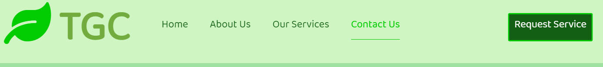
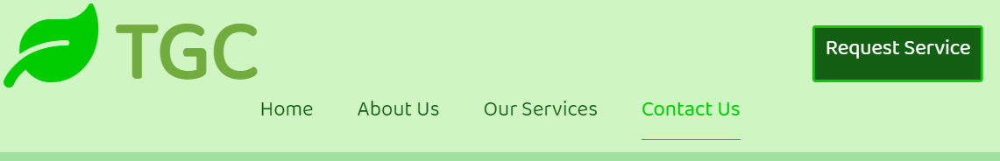
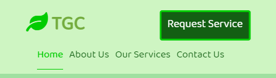
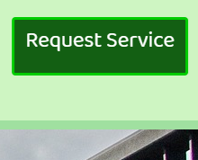
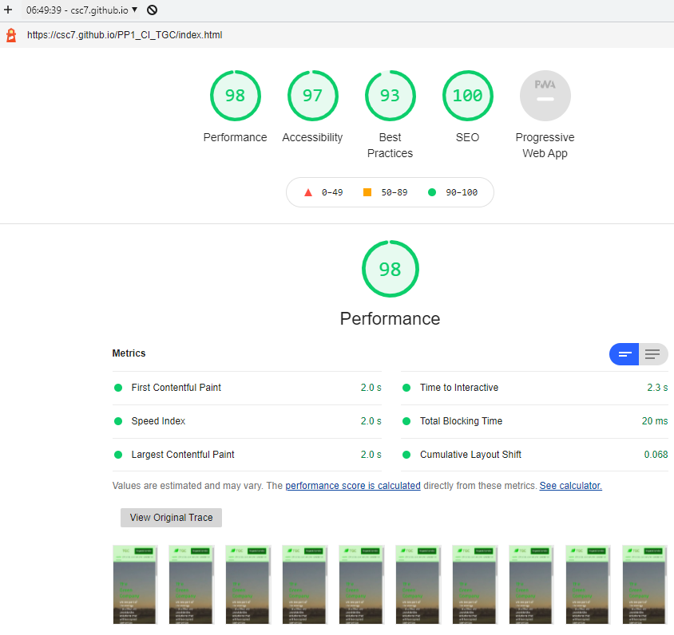
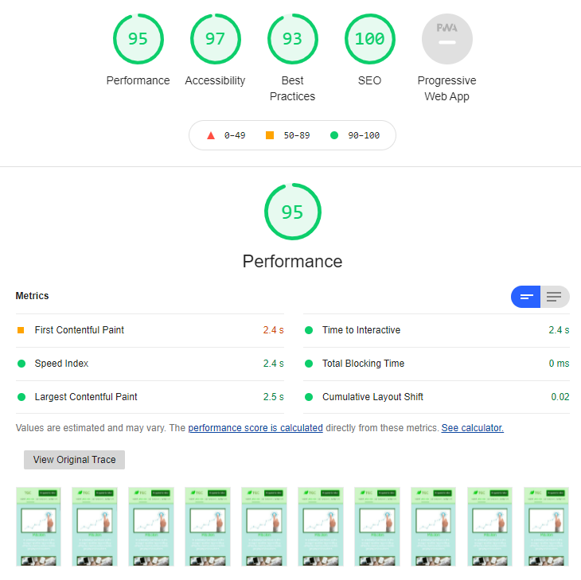
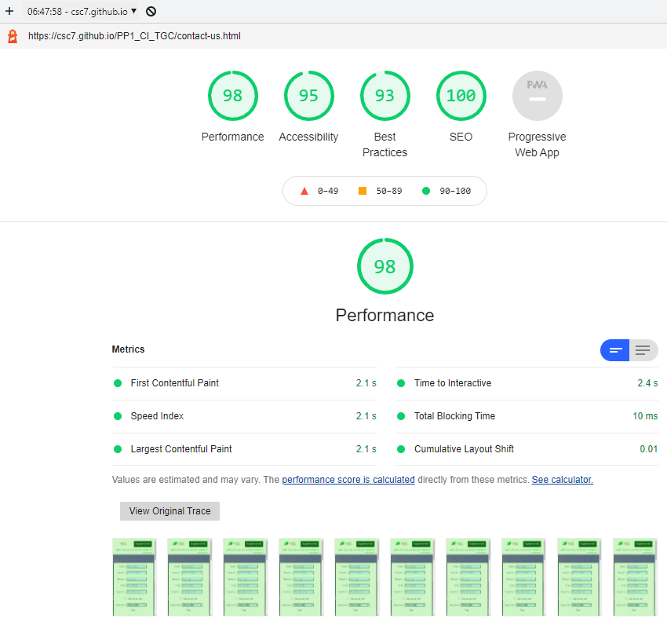
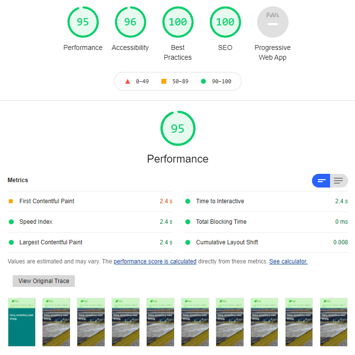

# TGC - The Green Company
This website is about a fictitious company. Excpet for the contect referenced in this README file, all content is invented by me, anything matching reality is jsut a coincidence.

This repository belongs to my first milestone project in the Full-stack Development course at Code Institute, covering HTML and CSS along with Git version control and other design tools.

The live link for this projects is [this one](https://csc7.github.io/PP1_CI_TGC/).
   

___
# 1. Project Goals
The goals of the project is to develop a website for a company that provides several geophysical services for diverse projects in the curren energy transition towards greener energies and less CO2 emissions.

Specifically, the goals are the following ones:
* To show all services that the company offers.
* To offer the company a simple way of being contacted.
* To offer the company a simple way of selling services.
* To offer the comapny a simple way of showing its structure.
* To provide users a clear view of the services available.
* To provide users a simple way of requesting services.
* to provide users a simple way of contacting the company.
   

___
# 2. User Experience

UX has been addressed (and remains as a constant activity) around Jesse James Garrett's process, whose five planes involves the following matters:
- STRATEGY: to build a website (product) for a company who wants to sell services.
- SCOPE: the minimum viable product needs to include features that allow the user to know the following:
    - Basic organisational information about the company.
    - Which services it provides.
    - How to contat the company.
    - How to request services.
    - Be informed about the lastest news.
- STRUCTURE: the information is structured as follows:
    - Basic organisational information about the company: in a separate page.
    - Which services it provides: in a separate page.
    - How to contat the company: both in a separate page and in a fixed button.
    - How to request services: in a fixed button.
    - Be informed about the lastest news: in the home page.
- SKELETON: the information is accessed through a fixed navigation menu on top of the pages, which in addition has a button to request services.
- SURFACE: the website is based on green colors (to be in line with the company activity and name), contains images and a video related to its activity, and will summarise information in tables as much as possible.

## User Stories
They are organised in thre groups: users (including feedback), organisation/site owner and user interface.
## Users
- ### User Goals
1. A website where navigation is easy and intuitive.
2. Rather than a long description of the services, basic information with a fast method for requesting the service.
3. To infer the size of the company at a glance.
4. To know what services can be provided by the company.
5. To know where the main office is located.
6. To be able to make consultations.
- ### User Requirements
7. A simple way of contacting the company.
8. An option where a user is able to give personal details while keepingthe decision of opting out of marketing communications.
9. A navigation menu that is always visible and able to provide access toall the website.
10. An easy way to request services.
11. An easy way to obtian company's contact details.
- ### User Expectations
12. Not to get "lost" while naviting the website.
13. A website that is accessible from any device and screen size.
14. A website that only opens new windows for external websites.
15. To have the option to contact the company without getting into complexprocesses, while mantaining the option to avoid unsolicited marketingphone calls.
 - ### User Feedback
16. "Our wind energy company is small in size and benefits from flexibleprocedures for contracting services; we want a website like the one of TheGreen Company that offers them with a quick way of contracting, so that wecan address our project requests very quickly and agilely".
17. "We are a manpower company that needs to respond to client requests asquick as possible, with as many services as possible; we see The GreenCompany's website a convenient way to select and hire different types ofgeophysical services".
18. "I am a consultant who sometimes needs to build dedicated teams toaddress service requests for specific projects (most of them in the studyof grounds for solar projects); I see The Green Company as an excellentway to get information about available services without the need of goingthrough long processes and without the need of exchanging personal data(which many times is confidential due to the nature of the projects I workin)".
19. "Our company deals with many energy projects (most of then in thegeothermal and eolic energy spectrum) and we find the website of The GreenCompany a quick and convenient way of having a summary of most requiredservices, with the additional benefit of contracting them directly".
### Organisation/Site Owner
- ### Organisation/Site Owner Goals
20. To capture clients.
21. To sell services.
22. To have a simple website where users do not "get lost" when navigating.
23. To show all services that the company offers in a summarised way.
24. To provide basic information of the structure of the comapny.
25. To receive consultations from potential clients.
26. To provide a simple contact form where the client feels that privacyis respected.
27. To offer a quick call to action, through a button, to contractservices.
28. In order to address clients with similar characteristics, to brieflyinform users about company's mission, values and vision.
29. To inform about latest news of the company.
- ### Organisation/Site Requirements
30. To provide a contact form to users where they can make consultations.
31. To have a simple a always-accessible button to request servcies (toadd value when compared to other companies and to increase chances ofcapturing clients not fully decided).
32. To provide a map with the location of the company's office.
33. To show in the home page a slogan about what the company is.
34. To have a section, most likely in the footer, with links to company'se-mail address and social network links.
35. To show the name of the company along with the name of the page in thetitle of the brower tab.
- ### Organisation/Site Expectations
36. To have a permanent working site.
37. To provide simple navigation through the website.
38. To have a website which is itself an advertising tool.
39. To have a good design, inline with company's services.
40. To have the website visible in search engines.
### User Interface
41. Fixed navigation menu on top.
42. Fixed button, on navigation menu, to request services.
43. Footer with links to company's e-mail address and social network links.
44. Section with company's mission, values and vission.
45. Table with last relevant projects of the company.
46. Table with departments of the company.
47. Section with latest news of the company.
48. Contact form for users.
49. Map with office location.
   

___
# 3.  Design Choices
## Colors
Green is the main color of the project. The reason for this selection is to be in line with the nature of the company (whose services are focused in the current transition energy) and with the name of the company: The Green Company.

The background color is green/grey, rgb(186, 233, 227), in order to have contrast with the content of the website while keeping the green-color tendency of the design.
## Fonts
Google fonts (please see credits section below) were implemented in the website. Roboto was selected for the paragraph as it is modern and easy to read. Following Google's recommendations, Baloo Tammudu 2 was also selected as complement for the titles.
Arial font is used as a back-up in case the previous fonts cannot be loaded.

Color #003300 (dark green) was selected for the body in order to have strong contrast with the white background of the body.
To differentiate the navigation menu and the request service button,  #135f13 (different dark green) is selected; while #276609 is selected to highlight all headings.

The name of the company in the logo uses #73ac3e to have a unique color.
## Structure
Following expectations of the owner, the metadata includes the following keywords to help search engines to find the website: geophysics, services, modelling, acquisition, processing, wind, geothermal, carbon, capture, CO2, operations. In addition, to help find the developer and this project, the following keywords are added: Code Institute, software development, student, full-stack course, milestone project.

The name of the company along with the name of the page are included in the head element (in the title) in order to comply with the expectations of the owner.

The visible websites is organised in a header, a body and a footer.

Wireframes were developed at the beginning in order to have a first design of the website.

- ### Header

In order to achive the goals related to easiness and/or simplicity, a fixed navigation area in the header is provided. In the same area, the company's logo is place to the left, and a "quick" button to request services on the right, so users are able to contract services in a very fast way.

This "quick" button, whose name is "Request Service", pops up a modal form (taken from Bootstrap, please see credits section below) where the user is able to contract specific services.

- ### Body

The body of the pages are structured as follows for each of the pages:
* Home: it contains an environmental-friendly background video with a slogan of the company and the services it offers.
* About Us: it has an upper section, divided in three subsections, where a picture, title and text for Mission, Values and Vision are allocated.\
In order to keep symmetry as accurate as possible, Values (which are shown in a list) are located in the middle.\
This section is followed, downwards, by another section (which lies in the middle of the body) that contains a table with the last projects of the company (those in year 2021).\
Finally, at the bottom of the body, there is another section that contains a table that shows the amount of people per department in the company.\
The desined is carried out for a screen size of 1024x1536 pixels (double in vertical lenght than the home page).
* Our services: it contains pictures in a carousel (taken from Bootstrap, please see credit sections below).\
Below, in a section, there are columns that contain the titles of the services and text for each of them.\
They are structured in a 3x2 arrange for desktop and tablet presentations, and 1x6 for mobile devices.\
* Contact Us: on the left, there is a form where the users are able to send consultations. It has options to avoid marketing communications and being contacted by telephone, as expected by users.\
On the right, there is a map of the office (above) and contact details can be found below the map.\
This page has a background picture of the office.

- ### Footer

The footer contains links for social media, office location and company's principal e-mail of contact.\

- ### Wireframes
Wireframes were developed at the beginning of the project with Balsamic Wireframes software. The first design was carried out for desktop devices, assuming a screen size of 1024x768 pixels.

Tablets...\

Mobile devices...\ 
   

___
# 4. Technologies used
- ## HTML ##
- ## CSS ##
- ## GitHub ##
- ## Gitpod ##
   

___
# 5. Features
The website consists of four pages, where each of them is divided in three parts: header, body and footer. The features contained in each of the pages and parts are the following ones:
  

- ## Fixed navigation menu

It is located in the header, fixed on all pages to facilitate navigation, and responsive.

**User Stories Addressed by this Feature:** 1; 9; 10; 12; 27; 41
  

- ## Fixed Button to Request Services
It is also located in the header, fixed to the right of the navigation menu, to keep it very accessible.

**User Stories Addressed by this Feature:** 1; 9; 10; 12;
  

- ## Feature
Description

**User Stories Addressed by this Feature:** 1; 9; 10; 12;
  

- ## Feature
Description

**User Stories Addressed by this Feature:** 1; 9; 10; 12;
  

- ## Feature
Description

**User Stories Addressed by this Feature:** 1; 9; 10; 12;
  

- ## Feature
Description

**User Stories Addressed by this Feature:** 1; 9; 10; 12;
  

- ## Feature
Description

**User Stories Addressed by this Feature:** 1; 9; 10; 12;
  

___
# 6. Testing
## **Validation**
The following tools were used to validate the files of the website:
- ### HTML Files
https://validator.w3.org/ was used to validate the HTML files. All files ended up with zero errors and warnings.
Please check the evidence below:

    
Home Page

 

    
About Us Page

    
Our Services Page

 

    
Contact Us Page

 

    
404 Page

 

 

- ### CSS File
https://jigsaw.w3.org/css-validator/ was used to validate the CSS file.
Please check the evidence below:

    

            
Valid CSS!

    
CSS Filee

 
 

  

- ### Accessibility
https://wave.webaim.org/ was used to validate accessibility. Although there are warnings, all pages contains zero errors. Please check evidence below:

    
Home Page

 

    
About Us Page

    
Our Services Page

 

    
Contact Us Page (99)

 

    
404 Page

 

 

- ### Performance
Lighthouse from Google was used to evaluate the performance of the pages. Please check the results below:

    
Home Page (98)

 

    
About Us Page (95)

    
Our Services Page (96)

 

    
Contact Us Page (98)

 

    
404 Page

 

 

 

## **Testing of User Stories**
The following are testing procedures applied to User Stories, referenced by numbers:
  
- ### **User Goals**
| N° | FEATURE | ACTION | EXPECTED RESULT | ACTUAL RESULT | IMAGE |
| --- | --- | --- | --- | --- | --- |
| 1 | A website where navigation is easy and intuitive. | sdfsadf as f | sdfasdf | sdfssdfaASDFSDFSDFSD\ FSDFSDFSDFSDFSDFSDFSD SDFSFs |  |
| 2 | Rather than a long description of the services, basic information with a fast method for requesting the service. | ACTION | EXPECTED RESULT | ACTUAL RESULT |  |
| 3 | To infer the size of the company at a glance. | ACTION | EXPECTED RESULT | ACTUAL RESULT | IMAGE |
| 4 | To know what services can be provided by the company. | ACTION | EXPECTED RESULT | ACTUAL RESULT | IMAGE |
| 5 | To know where the main office is located. | ACTION | EXPECTED RESULT | ACTUAL RESULT | IMAGE |
| 6 | To be able to make consultations. | ACTION | EXPECTED RESULT | ACTUAL RESULT | IMAGE |

  
- ### **User Requirements**
| N° | FEATURE | ACTION | EXPECTED RESULT | ACTUAL RESULT | IMAGE |
| --- | --- | --- | --- | --- | --- |
| 7 | A simple way of contacting the company. | ACTION | EXPECTED RESULT | ACTUAL RESULT |  |
| 8 | An option where a user is able to give personal details while keeping the decision of opting out of marketing communications. | ACTION | EXPECTED RESULT | ACTUAL RESULT | IMAGE |
| 9 | A navigation menu that is always visible and able to provide access to all the website. | ACTION | EXPECTED RESULT | ACTUAL RESULT | IMAGE |
| 10 | FEATURE | ACTION | EXPECTED RESULT | ACTUAL RESULT | IMAGE |
| 11 | FEATURE | ACTION | EXPECTED RESULT | ACTUAL RESULT | IMAGE |

  
- ### **User Expectations**
| N° | FEATURE | ACTION | EXPECTED RESULT | ACTUAL RESULT | IMAGE |
| --- | --- | --- | --- | --- | --- |
| 12 | FEATURE | ACTION | EXPECTED RESULT | ACTUAL RESULT |  |
| 13 | FEATURE | ACTION | EXPECTED RESULT | ACTUAL RESULT | IMAGE |
| 14 | FEATURE | ACTION | EXPECTED RESULT | ACTUAL RESULT | IMAGE |
| 15 | FEATURE | ACTION | EXPECTED RESULT | ACTUAL RESULT | IMAGE |

  
- ### **User Feedback**
| N° | FEATURE | ACTION | EXPECTED RESULT | ACTUAL RESULT | IMAGE |
| --- | --- | --- | --- | --- | --- |
| 16 | FEATURE | ACTION | EXPECTED RESULT | ACTUAL RESULT |  |
| 17 | FEATURE | ACTION | EXPECTED RESULT | ACTUAL RESULT | IMAGE |
| 18 | FEATURE | ACTION | EXPECTED RESULT | ACTUAL RESULT | IMAGE |
| 19 | FEATURE | ACTION | EXPECTED RESULT | ACTUAL RESULT | IMAGE |
  
- ### **Organisation/Site Owner Goals**
| N° | FEATURE | ACTION | EXPECTED RESULT | ACTUAL RESULT | IMAGE |
| --- | --- | --- | --- | --- | --- |
| 20 | FEATURE | ACTION | EXPECTED RESULT | ACTUAL RESULT |  |
| 21 | FEATURE | ACTION | EXPECTED RESULT | ACTUAL RESULT | IMAGE |
| 22 | FEATURE | ACTION | EXPECTED RESULT | ACTUAL RESULT | IMAGE |
| 23 | FEATURE | ACTION | EXPECTED RESULT | ACTUAL RESULT | IMAGE |
| 24 | FEATURE | ACTION | EXPECTED RESULT | ACTUAL RESULT | IMAGE |
| 25 | FEATURE | ACTION | EXPECTED RESULT | ACTUAL RESULT | IMAGE |
| 26 | FEATURE | ACTION | EXPECTED RESULT | ACTUAL RESULT | IMAGE |
| 27 | FEATURE | ACTION | EXPECTED RESULT | ACTUAL RESULT | IMAGE |
| 28 | FEATURE | ACTION | EXPECTED RESULT | ACTUAL RESULT | IMAGE |
| 29 | FEATURE | ACTION | EXPECTED RESULT | ACTUAL RESULT | IMAGE |

  
- ### **Organisation/Site Owner Requirements**
| N° | FEATURE | ACTION | EXPECTED RESULT | ACTUAL RESULT | IMAGE |
| --- | --- | --- | --- | --- | --- |
| 30 | FEATURE | ACTION | EXPECTED RESULT | ACTUAL RESULT |  |
| 31 | FEATURE | ACTION | EXPECTED RESULT | ACTUAL RESULT | IMAGE |
| 32 | FEATURE | ACTION | EXPECTED RESULT | ACTUAL RESULT | IMAGE |
| 33 | FEATURE | ACTION | EXPECTED RESULT | ACTUAL RESULT | IMAGE |
| 34 | FEATURE | ACTION | EXPECTED RESULT | ACTUAL RESULT | IMAGE |
| 35 | FEATURE | ACTION | EXPECTED RESULT | ACTUAL RESULT | IMAGE |

  
- ### **Organisation/Site Owner Expectations**
| N° | FEATURE | ACTION | EXPECTED RESULT | ACTUAL RESULT | IMAGE |
| --- | --- | --- | --- | --- | --- |
| 36 | FEATURE | ACTION | EXPECTED RESULT | ACTUAL RESULT |  |
| 37 | FEATURE | ACTION | EXPECTED RESULT | ACTUAL RESULT | IMAGE |
| 38 | FEATURE | ACTION | EXPECTED RESULT | ACTUAL RESULT | IMAGE |
| 39 | FEATURE | ACTION | EXPECTED RESULT | ACTUAL RESULT | IMAGE |
| 40 | FEATURE | ACTION | EXPECTED RESULT | ACTUAL RESULT | IMAGE |

  
- ### **User Interface**
| N° | FEATURE | ACTION | EXPECTED RESULT | ACTUAL RESULT | IMAGE |
| --- | --- | --- | --- | --- | --- |
| 41 | FEATURE | ACTION | EXPECTED RESULT | ACTUAL RESULT |  |
| 42 | FEATURE | ACTION | EXPECTED RESULT | ACTUAL RESULT | IMAGE |
| 43 | FEATURE | ACTION | EXPECTED RESULT | ACTUAL RESULT | IMAGE |
| 44 | FEATURE | ACTION | EXPECTED RESULT | ACTUAL RESULT | IMAGE |
| 45 | FEATURE | ACTION | EXPECTED RESULT | ACTUAL RESULT | IMAGE |
| 46 | FEATURE | ACTION | EXPECTED RESULT | ACTUAL RESULT | IMAGE |
| 47 | FEATURE | ACTION | EXPECTED RESULT | ACTUAL RESULT | IMAGE |
| 48 | FEATURE | ACTION | EXPECTED RESULT | ACTUAL RESULT | IMAGE |
| 49 | FEATURE | ACTION | EXPECTED RESULT | ACTUAL RESULT | IMAGE |
   

___
# 8. Bugs
EXPLAIN
   

___
# 9. Deployment
   

___
# 10. Credits

* Code Institute: I have used the learning material in the course as a guide and reference.
* Love Running - Essentials Project, from Code Institute, as a guide, source of design concepts and code for this project.
* Balsamiq Wireframes: I have used it to create all the wireframes.
* ...
* Font Awesome:
    * Logo of "The Green Company": downloaded on June 9th, 2021, 23:54 from https://fontawesome.com/v5.15/icons/leaf?style=solid <i class="fas fa-leaf"></i>
    * Icos for LinkedIn, Facebook, Twitter, Instagram, map locator and e-mail/envelope: downloaded on June 10th, 2021, 10:05 from https://fontawesome.com/v5.15/icons?d=gallery&p=2
    * ...
* Bootstrap:
    * To get started and install required links and scripts (in the HTML head and below the footer, respectively). Webpage accessed and code copied on June 10th, 2021, 00:23, from https://getbootstrap.com/docs/4.0/getting-started/introduction/
    * "Request Service" button for modal: code copied on June 10th, 2021, 00:14 from https://getbootstrap.com/docs/4.0/components/modal/
    * Carousel in our-services page: copied on June 17th, 2021, at 5:50, from https://getbootstrap.com/docs/4.0/components/carousel/
* Google:
    * Fonts: Baloo Tammudu 2 and Roboto, first imported on June 10th, 2021, 01:10, from https://fonts.google.com/.
    * Google maps: accessed on June 15th, 2021, at 16:18, at https://developers.google.com/maps/documentation/embed/get-started
* W3Schools:
    * References for coding.
    * Font color picker: accessed on June 10th, 2021, 01:45, at https://www.w3schools.com/colors/colors_picker.asp
    * CSS flex-direction property: accessed and copied on June 10th, 2021, 6:40, from https://www.w3schools.com/cssref/css3_pr_flex-direction.asp
    * Video: accessed on June 10th, 2021, 07:45, to https://www.w3schools.com/howto/howto_css_fullscreen_video.asp
    * Center a table with CSS: accessed on June 15th, 2021, at 1:50, at https://www.w3schools.com/howto/howto_css_table_center.asp
    * Borders: accessed on June 16th, 2021, 2:33, from https://www.w3schools.com/css/css_border_rounded.asp.
    * Form styling: accessed on June 16th, 2021, 3:33, from https://www.w3schools.com/css/tryit.asp?filename=trycss_form_responsive .
* Stackoverflow:
    * Borders of input fields in forms: accessed on June 17th, 2021, at 3:15, at https://stackoverflow.com/questions/3397113/how-to-remove-focus-border-outline-around-text-input-boxes-chrome
    * Solution to show modal window above page elements: copied on June 19th, 2021, at 3:17, from https://stackoverflow.com/questions/10636667/bootstrap-modal-appearing-under-background
    * Alignment on anchor element on top: accessed on June 20th, 2021, at 0:48, at https://stackoverflow.com/questions/924282/why-is-vertical-aligntext-top-not-working-in-css
* Home page video: "Wind Turbine on a Field at Sunrise", downloaded on June 9th, 2021, at 22:38, from https://www.pexels.com/video/wind-turbine-on-a-field-at-sunrise-857010/
* Videos:
    * Home page: invisiblepower, Wind Turbine on a Field at Sunrise, downloaded on June 9th, 2021, at 22:38, from https://www.pexels.com/video/wind-turbine-on-a-field-at-sunrise-857010/
* Images:
    * About Us page:
        * Mission: target-3535310_640.jpg, downloaded on June 15th, 2021, at 2:37, from https://pixabay.com/photos/target-business-idea-growth-3535310/
        * Values: paper-3213924_640.jpg, downloaded on June 15th, 2021, at 2:51, from https://pixabay.com/photos/paper-business-finance-document-3213924/
        * Vision: vision-2372177_640.jpg, downloaded on June 15th, 2021, at 2:19, from https://pixabay.com/photos/vision-mission-goal-target-2372177/
    * Our Services page:
        * pexels-kalina-ost-2865025.jpg, downloaded on May 7th, 2021, from https://www.pexels.com/es-es/foto/foto-del-paisaje-del-molino-de-viento-blanco-2865025/
        * pexels-kelly-lacy-2800832.jpg, downloaded on May 7th, 2021, from https://www.pexels.com/es-es/foto/foto-de-vista-superior-de-paneles-solares-2800832/
        * pexels-kelly-lacy-4320473.jpg, downloaded on May 8th, 2021, from https://www.pexels.com/es-es/foto/naturaleza-campo-construccion-industria-4320473/
        * pexels-kelly-lacy-4320481.jpg, downloaded on May 7th, 2021, from https://www.pexels.com/es-es/foto/tierra-campo-verano-construccion-4320481/
    * Contact Us page:
        * Backgraound image: stockvault-office-building236904.jpg, downloaded on June 16th, 2021, 2:09, from https://www.stockvault.net/photo/236904/office-building
    * 404 Page:
        * Background image: Tom Fisk photo, pexels-tom-fisk-1605268.jpg, downloaded on May 8th, 2021, from https://www.pexels.com/es-es/foto/molinos-de-viento-y-campo-de-hierba-verde-1605268/

* Maps in Contact Us page:
    * Leaflet, accessed on June 15th, 2021, 16:45, from https://leafletjs.com/examples/quick-start/. Finally not used.
    * Google maps: iframe element for Madrid copied on June 16th, 2021, at 1:53, from https://www.google.com/maps/
   

___
# 10. Acknowledgements
I would like to acknowledge and thank the following people for being part of this project and for helping me in the development of it:
* Code Institute, for providing knowledge, guide and tools.
* My mentor (CHECK IF I CAN PUBLISH HIS NAME), for helping with very valuable guide and support.
* ...
