# **TGC - The Green Company**

This website is about a fictitious company. Excpet for the contect referenced in this README file, all content is invented by me, anything matching reality is jsut a coincidence.

This repository belongs to my first milestone project in the Full-stack Development course at Code Institute, covering HTML and CSS along with Git version control and other design tools.

The live link for this projects is [this one](https://csc7.github.io/PP1_CI_TGC/).
  

*Image with home page of the project in different devices. Image generated with Am I Responsive? website http://ami.responsivedesign.is/?url=https%3A%2F%2Fcsc7.github.io%2FPP1_CI_TGC*
   

# **Index**
#### [*Website Live Link*](https://csc7.github.io/PP1_CI_TGC/)
### [1. Project Goals](#1--project-goals)
### [2. User Experience](#2--user-experience)
- #### [User Goals](#user-goals-1)
- #### [Organisation/Site Owner Goals](#organisationsite-owner-goals-1)
- #### [User Stories](#user-stories-1)
- #### [User Requirements and Expectations](#user-requirements-and-expectations-1)
### [3. Design Choices](#3--design-choices)
- #### [Colors](#colors-1)
- #### [Fonts](#fonts-1)
- #### [Structure](#structure-1)
### [4. Wireframes](#4--wireframes)
### [5. Technologies used](#5--technologies-used)
- #### [Languages](#languages-1)
- #### [Software and Other Tools](#software-and-other-tools-1)
### [6. Features](#6--features)
### [7. Validation](#7--validation)
- #### [HTML Files](#html-files-1)
- #### [CSS File](#css-file-1)
- #### [Accessibility](#accessibility-1)
- #### [Performance](#performance-1)
### [8. Testing of User Stories](#8--testing-of-user-stories)
### [9. Bugs](#9--bugs)
### [10. Deployment](#10--deployment)
### [11. Credits](#11--credits)
### [12. Acknowledgements](#12--acknowledgements)
   

___
# **1 . Project Goals**
The goals of the project is to develop a website for a company that provides several geophysical services for diverse projects in the current energy transition towards greener energies and less CO2 emissions.

Specifically, the goals of the project are the following ones:
- To build a website that provides users a summarised view of the company and the services it offers.
- To provide a point of contact for offering (by the company) and requesting services (by clients).
- To build a website where navigation is easy and intuitive.
- To offer an easy call to action for requesting services.
- To build a website which is itself an advertising tool.
- To have a good design, inline with company's services.
- To have the website visible in search engines.
  
## [Back to Index](#index)
 

___
# **2 . User Experience**

UX has been addressed (and remains as a constant activity) around Jesse James Garrett's process, whose five planes involves the following matters:
- **STRATEGY**: to build a website (product) for a company who wants to sell services.
- **SCOPE**: the minimum viable product needs to include features that allow the user to know the following:
    - Basic organisational information about the company.
    - Which services it provides.
    - How to contat the company.
    - How to request services.
    - Be informed about the lastest news.
- **STRUCTURE**: the information is structured as follows:
    - Basic organisational information about the company: in a separate page.
    - Which services it provides: in a separate page.
    - How to contat the company: both in a separate page and in a fixed button.
    - How to request services: in a fixed button.
    - Be informed about the lastest news: in the home page.
- **SKELETON**: the information is accessed through a fixed navigation menu on top of the pages, which in addition has a button to request services.
- **SURFACE**: the website is based on green colors (to be in line with the company activity and name), contains images and a video related to its activity, and will summarise information in tables as much as possible.

## **User Goals**
- To know services being offered at a glance.
- To find a website with a simple way of requesting services.
- To easily contact the company.
- To get basic information of the company.
- Rather than a long description of the services, to have basic information with a fast method for requesting them.
- To easily find company's contact details.
- To navigate the website intuitevely, withoug issues.

#### [Back to Index](#index)

## **Organisation/Site Owner Goals**
- To capture clients.
- To sell services.
- To have a simple website where users do not "get lost" when navigating.
- To show all services that the company offers in a summarised way.
- To provide basic information of the structure of the comapny.
- To receive consultations from potential clients.
- To provide a simple contact form where the client feels that privacyis respected.

#### [Back to Index](#index)

## **User Stories**
User stories are divided into the following three groups:

- ### **First time users**
1. As a client, I want to know what services I can hire, so do not need to ask for more information to learn their services.
2. As a client, I want to see a list of projects that has been carried out by the company, so I have an idea if they are able to address my own projects.
3. As a client, I want to know the size of the company at a glance, in order to know if the company has resources to achieve my projects.
4. As a client, I want to have an easy option to contract services, so I do not need to go through long procedures.
5. As job-seeker, I want to know where the main office is located, to know if a move is needed in case I get a job.
6. As an equipment seller, I want to have a way to contact the company, to know if there might be any product of interest to them.
7. As a client, I want to have a contact form to make general consultations in case I do not find what I am looking for.
8. As a client, I want to have a fixed navigation menu on top, so I do not get lost when looking for information.
9. As a client, I want to see a phrase that summarizes the activity of the company, so I know from the beginning if I am in the correct website.

- ### **Returning users**
10. As a client, I want to be updated with the latest news of the company, in order to know company's performance and understand current and future capabilities.
11. As a client, I want to easily contact them in order to address any issue with my requests.
12. As a client, I want to know what the last projects are, so I have an idea of how they are performing in the marked.
13. As a client, I want to know the size of the company, to check its evolution through time and infere if they are growing or they are not.

- ### **Organisation/Site Owner**
14. As owner, I want to briefly show my services, so I promote our company and clients know what can be hired.
15. As owner, I want to offer a quick call to action through a button, so clients can easily contract my services.
16. As owner, I want to give a short description of my my mission, values and vision, so clients known in advance my profile before closing a deal.
17. As owner, I want to show my lastest news, so I keep transparency and perform my own advertising.
18. As owner, I want to inform about my structure, so clients know in advance if my company will be able to address their needs.
19. As owner, I want to inform of my last projects, so I promote our company and simultaneously show clients about my capabilities.
20. As owner, I want an easy way to be contacted, so clients are able to consult their matters and do not see my company as a complicated option to get information or to request services.
21. As owner, I want my brand to be promoted and reinforced, so users associate geophysical services for the energy transition with my company.

#### [Back to Index](#index)

## **User Requirements and Expectations**
- A fixed and responsive navigation menu on top.
- A call-to-action button, always present and fixed in the navigation menu, to request services.
- A first welcome page with latest news.
- A second page with company's mission, values, vision, a table with latest projects, and a table with departments and amount of people in each of them.
- A third page showing the services offered by the company.
- A fourth page with a contact form, office location map, and contact details.
- A footer with links to company's social networks and e-mail address.
- An error page to be shown in case a user does not provide a correct URL. 
- A website that is accessible from any device and screen size.
- A website that only opens new windows for external websites.
- Company's slogan in the welcome page.
- To show an icon, the name of the company, and the name of the page in the title of brower windows/tabs.
  
## [Back to Index](#index)
 

___
# **3 . Design Choices**

The design was planned to cover screen sizes from 320x568px to 1920x1370px.

## **Colors**
Green is the main color of the project. The reason for this selection is to be in line with the nature of the company (whose services are focused in the current transition energy) and with the name of the company: The Green Company.

The background color is green/grey, rgb(186, 233, 227), in order to have contrast with the content of the website while keeping the green-color tendency of the design.

#### [Back to Index](#index)

## **Fonts**
Google fonts (please see credits section below) were implemented in the website. Roboto was selected for the paragraph as it is modern and easy to read. Following Google's recommendations, Baloo Tammudu 2 was also selected as complement for the titles.
Arial font is used as a back-up in case the previous fonts cannot be loaded.

Color #003300 (dark green) was selected for the body in order to have strong contrast with the white background of the body.
To differentiate the navigation menu and the request service button,  #135f13 (different dark green) is selected; while #276609 is selected to highlight all headings.

The name of the company in the logo uses #73ac3e to have a unique color.

#### [Back to Index](#index)

## **Structure**
Following expectations of the owner, the metadata includes the following keywords to help search engines to find the website: geophysics, services, modelling, acquisition, processing, wind, geothermal, carbon, capture, CO2, operations. In addition, to help find the developer and this project, the following keywords are added: Code Institute, software development, student, full-stack course, milestone project.

The name of the company along with the name of the page are included in the head element (in the title) in order to comply with the expectations of the owner.

The visible websites is organised in a header, a body and a footer.

Wireframes were developed at the beginning in order to have a first design of the website.

- ### **Header**

In order to achive the goals related to easiness and/or simplicity, a fixed navigation area in the header is provided. In the same area, the company's logo is place to the left, and a "quick" button to request services on the right, so users are able to contract services in a very fast way.

This "quick" button, whose name is "Request Service", pops up a modal form (taken from Bootstrap, please see credits section below) where the user is able to contract specific services.

- ### **Body**

The body of the pages are structured as follows for each of the pages:
- #### *Home:*
    It contains an environmental-friendly background video with a slogan of the company and the services it offers.
- #### *About Us:*
    It has an upper section, divided in three subsections, where a picture, title and text for Mission, Values and Vision are allocated.
    In order to keep symmetry as accurate as possible, Values (which are shown in a list) are located in the middle.\
    This section is followed, downwards, by another section (which lies in the middle of the body) that contains a table with the last projects of the company (those in year 2021).\
    Finally, at the bottom of the body, there is another section that contains a table that shows the amount of people per department in the company.\
    The desined is carried out for a screen size of 1024x1536 pixels (double in vertical lenght than the home page).
- #### *Our services:*
    It contains pictures in a carousel (taken from Bootstrap, please see credit sections below).\
    Below, in a section, there are columns that contain the titles of the services and text for each of them.\
    They are structured in a 3x2 arrange for desktop and tablet presentations, and 1x6 for mobile devices.\
- #### *Contact Us:*
    On the left, there is a form where the users are able to send consultations. It has options to avoid marketing communications and being contacted by telephone, as expected by users\
    On the right, there is a map of the office (above) and contact details can be found below the map.\
    This page has a background picture of the office.

- ### **Footer**

The footer contains links for social media, office location and company's principal e-mail of contact.\
  
## [Back to Index](#index)
 

___
# **4 . Wireframes**

Wireframes were developed in order to gather all goals, user stories, requirements and expectations, and have the design references for desktop, tablet and mobile devices.
Please check the PDFs files for each case in the following links:

[PDF File for Desktop Wireframe](docs/wireframes/wireframe-desktop.pdf)

[PDF File for Tablet Wireframe](docs/wireframes/wireframe-tablet.pdf)

[PDF File for Mobile Wireframe](docs/wireframes/wireframe-mobile.pdf)
  
## [Back to Index](#index)
 

___
# **5 . Technologies used**

The following languages, software and tools were implemented using Windows 10 Pro:
## **Languages**
- #### **HTML**
- #### **CSS**

#### [Back to Index](#index)

## **Software and Other Tools**
- #### **GitHub**
- #### **Gitpod**
- #### **FontAwesome (v5.15)**
- #### **Bootstrap (v4.0)**
- #### **Balsamiq Wireframes (v4.2.4, Editor Version 2.6.0)**
- #### **Google Fonts**
- #### **Google Maps**
- #### **W3C Markup Validation Service**
- #### **W3C CSS Validation Service**
- #### **WAVE Web Accessibility Evaluation Tool**
- #### **Google Lighthouse (used in Google, Microsoft Edge and Firefox)**
  
## [Back to Index](#index)
 

___
# **6 . Features**

The website consists of four pages, where each of them is divided in three parts: header, body and footer. The features contained in each of the pages and parts are the following ones:

- ### **Company logo**

It is located in all pages, fixed, top-left, and always visible.
*User Stories Addressed by this Feature:* 8; 9 and 21.

*Please check "7. Testing of User Stories" for more details.*

    
Check Image

- ### **Fixed navigation menu**

It is located in the header, fixed on all pages to facilitate navigation, and responsive.
*User Stories Addressed by this Feature:* 4; 8; 15 and 21.

*Please check "7. Testing of User Stories" for more details.*

    
Check Image

- ### **Fixed "Request Button"**
It is located on top, in the navigation menu, to the right, fixed and present at all times, in all sizes. It allows to request any service from any page, in a simple way provided by a modal form.

*User Stories Addressed by this Feature:* 4 and 15.

*Please check "7. Testing of User Stories" for more details.*

    
Check Image

- ### **Welcome video**

It is located in the home page, in the upper part of the body section. It contains the slogan of the company (*"We are part of the energy transition, we provide the solutions that will be copied tomorrow"*) and behaves as a background video.
*User Stories Addressed by this Feature:* 1; 9 and 21.

*Please check "7. Testing of User Stories" for more details.*

    
Check Image

- ### **Latest News**

It is located in the lower part of the body, in the home page, and shows current and relevant news of the company.
*User Stories Addressed by this Feature:* 10 and 17.

*Please check "7. Testing of User Stories" for more details.*

    
Check Image

- ### **Mission, Values, Vision**

It is located in the About Us page, in the upper part of the body, showing the mission, values and vision of the company.
*User Stories Addressed by this Feature:* 16.

*Please check "7. Testing of User Stories" for more details.*

    
Check Image

- ### **Projects table**

It is located in the middle part of the body in the About Us page, showing latest projects (those in the curren year).
*User Stories Addressed by this Feature:* 2; 12 and 19.

*Please check "7. Testing of User Stories" for more details.*

    
Check Image

- ### **People Table**

It is located in the lower part of the body in the About Us page, showing the amount of people in each department of the company.
*User Stories Addressed by this Feature:* 3; 13 and 18.

*Please check "7. Testing of User Stories" for more details.*

    
Check Image

- ### **Carousel for services**

It is located in the Our Services page, upper part, with controls and messages to advertise the company.
*User Stories Addressed by this Feature:* 21.

*Please check "7. Testing of User Stories" for more details.*

    
Check Image

- ### **Services**

It is located in the Our Services page, lower part, showing the services that can be contracted.
*User Stories Addressed by this Feature:* 1 and 14.

*Please check "7. Testing of User Stories" for more details.*

    
Check Image

- ### **Contact form**

It can be found in the Contact Us page, on the left, and allows users to send consultations of any type.
*User Stories Addressed by this Feature:* 6; 7; 11 and 20.

*Please check "7. Testing of User Stories" for more details.*

    
Check Image

- ### **Office map**

It can be found in the Contact Us page, on the right, and show users where the office is located.
*User Stories Addressed by this Feature:* 5 and 22.

*Please check "7. Testing of User Stories" for more details.*

    
Check Image

- ### **Contact details**

It can be found in the Contact Us page, on the right, below the map. It contains the address and telephone of the company.
*User Stories Addressed by this Feature: 6; 7 and 11.

*Please check "7. Testing of User Stories" for more details.*

    
Check Image

- ### **Footer**

It is located at the bottom of all pages, containing icons with links to social networks and e-mail applications (to automatically load company's e-mail address in the addressee field).
*User Stories Addressed by this Feature:* 6; 7; 11; 20 and 21.

*Please check "7. Testing of User Stories" for more details.*

    
Check Image

- ### **404 page**

It is a different page that appears in case there is any issue loading the page, like a similar incorrect URL. It contains a background image related to the activity of the company, that repeats itself, and contains the message *"Sorry, something went wrong."*.
*User Stories Addressed by this Feature:* 8 and 9.

*Please check "7. Testing of User Stories" for more details.*

    
Check Image

  
## [Back to Index](#index)
 

___
# **7 . Validation**

The introductory image on top of this README file was generated using the [Am I Responsive site](http://ami.responsivedesign.is/?url=https%3A%2F%2Fcsc7.github.io%2FPP1_CI_TGC) to test how the website displays in different screen sizes.

The website was tested with the development tools of Google Chrome (mainly), Microsoft Edge, Microsoft Explorer and Firefox.

Development tools of Google Chrome, Microsoft Edge and Firefox were uses to test the behaviour of the website for screen sizes between 320x568px to 1920x1370px.

The following tools were used to validate the files of the website:

## **HTML Files**
https://validator.w3.org/ was used to validate the HTML files. All files ended up with zero errors and warnings.
Please check the evidence below:

    
Home Page

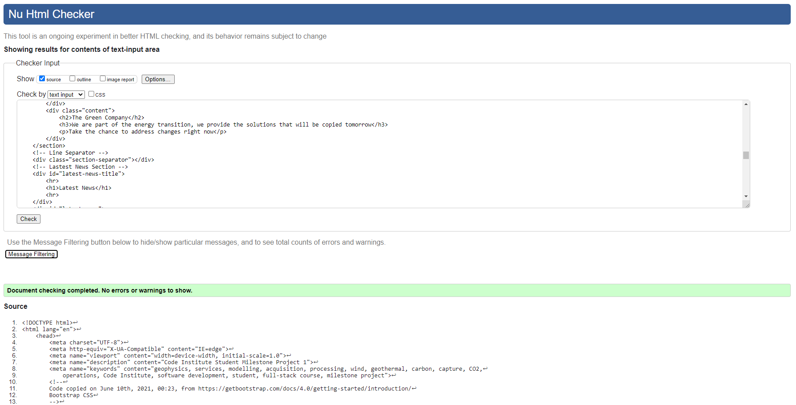 

    
About Us Page

    
Our Services Page

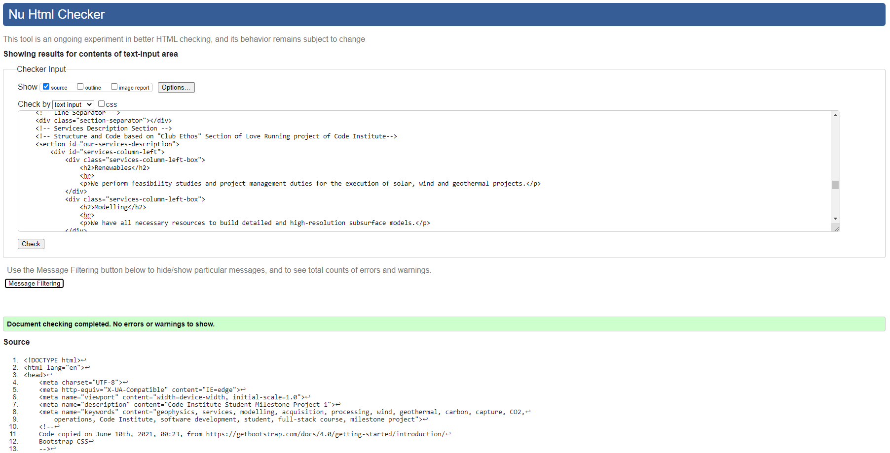 

    
Contact Us Page

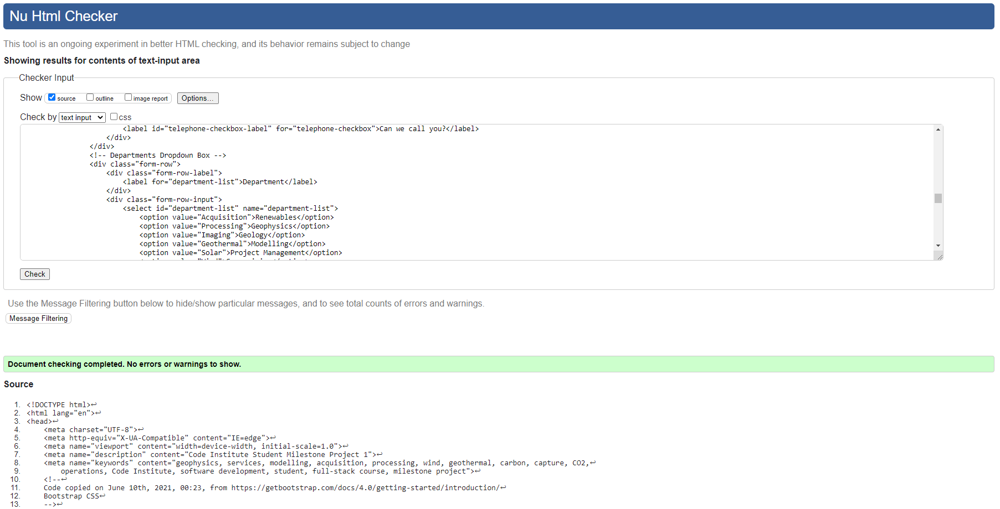 

    
404 Page

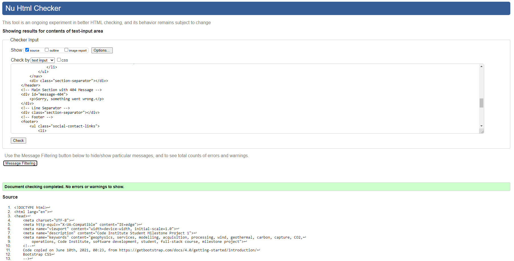 

#### [Back to Index](#index)

 

## **CSS File**
https://jigsaw.w3.org/css-validator/ was used to validate the CSS file.
Please check the evidence below:

    

            

     

    
CSS Filee

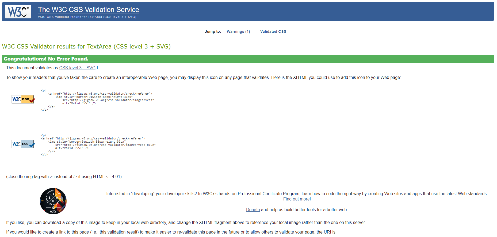 
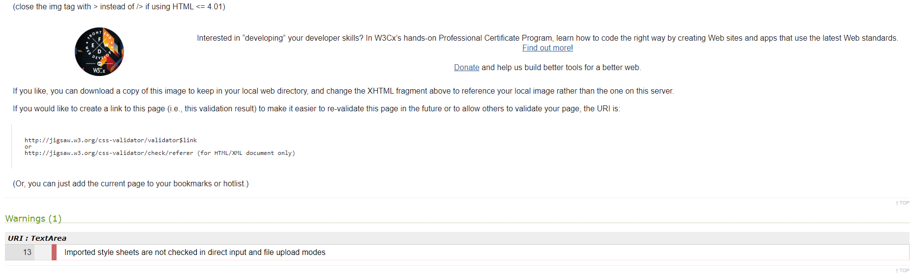 

#### [Back to Index](#index)

  

## **Accessibility**
https://wave.webaim.org/ was used to validate accessibility. Although there are warnings, all pages contains zero errors. Please check evidence below:

    
Home Page

 

    
About Us Page

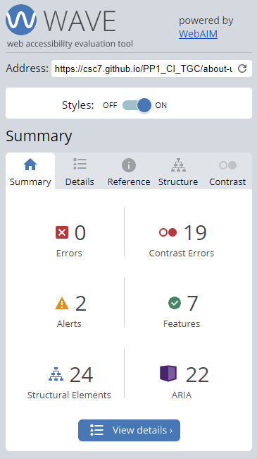

    
Our Services Page

 

    
Contact Us Page (99)

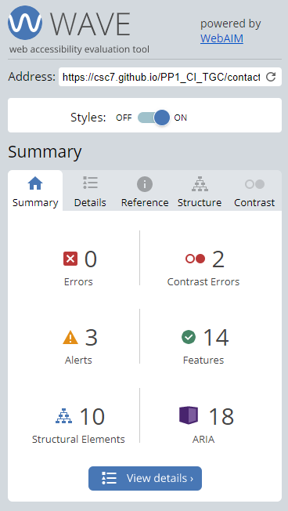 

    
404 Page

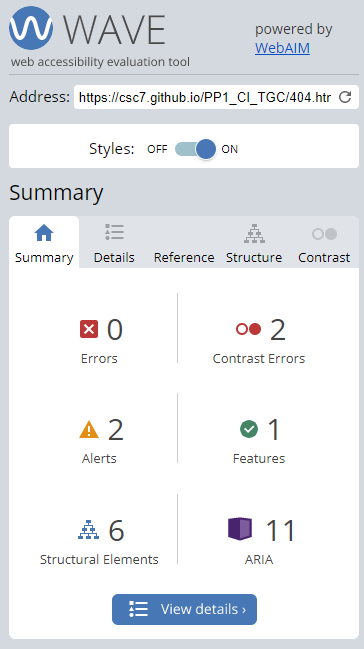 

#### [Back to Index](#index)

 

## **Performance**
Google Lighthouse (used in Google, Microsoft Edge and Firefox) were used to evaluate the performance of the pages. Please check the results below:

    
Home Page for Mobile(94)

 

    
Home Page for Desktop (99)

 

    
About Us Page for Mobile (98)

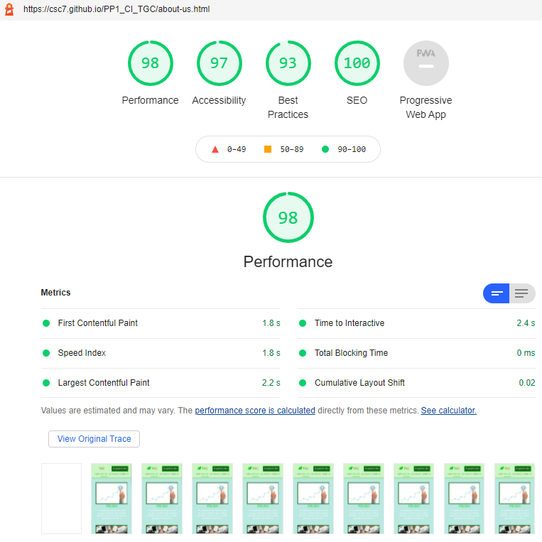

    
About Us Page for Desktop (99)

    
Our Services Page for Mobile (94)

 

    
Our Services Page for Desktop (99)

 

    
Contact Us Page for Mobile (91)

 

    
Contact Us Page for Desktop (100)

 

    
404 Page for Mobile (95, although it has been observed values from 84 to 99)

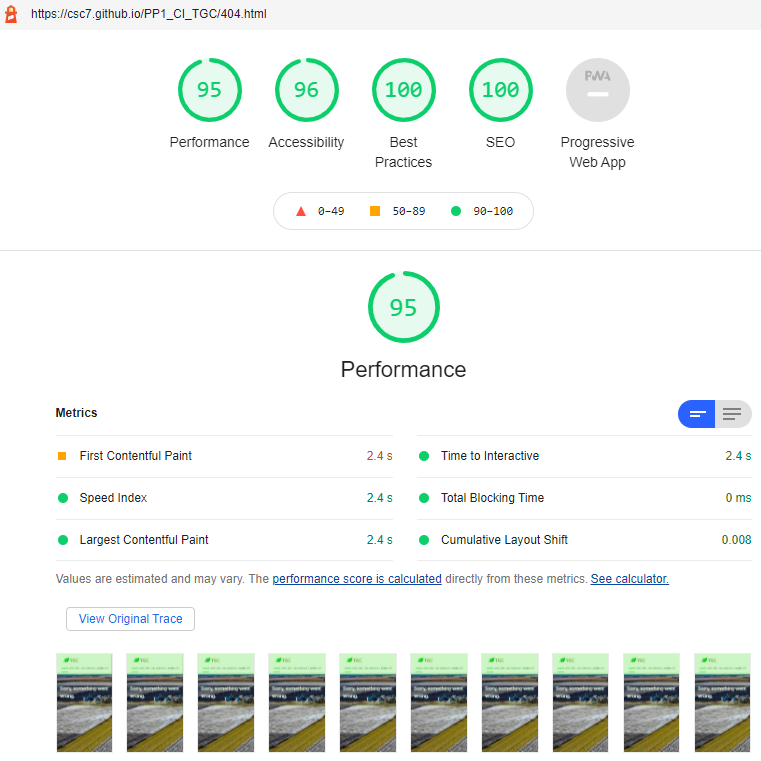 

    
404 Page for Desktop (99)

 

  
## [Back to Index](#index)
 

___
# **8 . Testing of User Stories**

The following are testing of User Stories previously described above:
  

1. As a client, I want to know what services I can hire, so do not need to ask for more information to learn their services.

| FEATURE | ACTION | EXPECTED RESULT | ACTUAL RESULT |
| --- | --- | --- | --- |
| Services | Scroll down in Our Services page | Find information about projects | Works as expected | 

    
Screenshot

 

  

2. As a client, I want to see a list of projects that has been carried out by the company, so I have an idea if they are able to address my own projects.

| FEATURE | ACTION | EXPECTED RESULT | ACTUAL RESULT |
| --- | --- | --- | --- |
| Projects table | Scroll down in About Us page | Find information about projects | Works as expected | 

    
Screenshot

 

  

3. As a client, I want to know the size of the company at a glance, in order to know if the company has resources to achieve my projects.

| FEATURE | ACTION | EXPECTED RESULT | ACTUAL RESULT |
| --- | --- | --- | --- |
| People Table | Scroll down in About Us page | Find information about projects | Works as expected | 

    
Screenshot

 

  

4. As a client, I want to have an easy option to contract services, so I do not need to go through long procedures.

| FEATURE | ACTION | EXPECTED RESULT | ACTUAL RESULT |
| --- | --- | --- | --- |
| Fixed "Request Button" | Click a button | A pop-up form to request a service | Works as expected |

    
Screenshot

 

  

5. As job-seeker, I want to know where the main office is located, to know if a move is needed in case I get a job.

| FEATURE | ACTION | EXPECTED RESULT | ACTUAL RESULT |
| --- | --- | --- | --- |
| Office map / Contact details | Open Contact Us page | Find location and contact information | Works as expected |

    
Screenshot

 
 

  

6. As an equipment seller, I want to have a way to contact the company, to know if there might be any product of interest to them.

| FEATURE | ACTION | EXPECTED RESULT | ACTUAL RESULT |
| --- | --- | --- | --- |
| Contact form or Footer | Open Contact Us page or click e-mail button in footer | Find contact form or open application to send e-mail | Works as expected |

    
Screenshot

 
 

  

7. As a client, I want to have a contact form to make general consultations in case I do not find what I am looking for.

| FEATURE | ACTION | EXPECTED RESULT | ACTUAL RESULT |
| --- | --- | --- | --- |
| Contact form or Footer | Open Contact Us page or click e-mail button in footer | Find contact form or open application to send e-mail | Works as expected |

    
Screenshot

 
 

  

8. As a client, I want to have a fixed navigation menu on top, so I do not get lost when looking for information.

| FEATURE | ACTION | EXPECTED RESULT | ACTUAL RESULT |
| --- | --- | --- | --- |
| Fixed navigation menu | Have navigation bar visible | Find navigation menu very easily | Works as expected, always visible and fixed |

    
Screenshot

 

  

9. As a client, I want to see a phrase or image or video that summarizes the activity of the company, so I know from the beginning if I am in the correct website.

| FEATURE | ACTION | EXPECTED RESULT | ACTUAL RESULT |
| --- | --- | --- | --- |
| Welcome video | Show company's slogan and image/video with related activity | Find this information in the home page | Works as expected |

    
Screenshot

 

  

10. As a client, I want to be updated with the latest news of the company, in order to know company's performance and understand current and future capabilities.

| FEATURE | ACTION | EXPECTED RESULT | ACTUAL RESULT |
| --- | --- | --- | --- |
| Latest news | Scroll down in home page | Find this information in the home page | Works as expected |

    
Screenshot

 

  

11. As a client, I want to easily contact them in order to address any issue with my requests.

| FEATURE | ACTION | EXPECTED RESULT | ACTUAL RESULT |
| --- | --- | --- | --- |
| Contact form / Footer | Open Contact Us page or click e-mail button in footer | Find contact form or open application to send e-mail | Works as expected |

    
Screenshot

 
 

  

12. As a client, I want to know what the last projects are, so I have an idea of how they are performing in the market.

| FEATURE | ACTION | EXPECTED RESULT | ACTUAL RESULT |
| --- | --- | --- | --- |
| Projects table | Scroll down in About Us page | Find information about projects | Works as expected | 

    
Screenshot

 

  

13. As a client, I want to know the size of the company, to check its evolution through time and infere if they are growing or they are not.

| FEATURE | ACTION | EXPECTED RESULT | ACTUAL RESULT |
| --- | --- | --- | --- |
| People Table | Scroll down in About Us page | Find information about projects | Works as expected | 

    
Screenshot

 

  

14. As owner, I want to briefly show my services, so I promote our company and clients know what can be hired.

| FEATURE | ACTION | EXPECTED RESULT | ACTUAL RESULT |
| --- | --- | --- | --- |
| Services | Scroll down in Our Services page | Find information about projects | Works as expected | 

    
Screenshot

 

  

15. As owner, I want to offer a quick call to action through a button, so clients can easily contract my services.

| FEATURE | ACTION | EXPECTED RESULT | ACTUAL RESULT |
| --- | --- | --- | --- |
| Fixed "Request Button" | Click a button | A pop-up form to request a service | Works as expected |

    
Screenshot

 

  

16. As owner, I want to give a short description of my my mission, values and vision, so clients known in advance my profile before closing a deal.

| FEATURE | ACTION | EXPECTED RESULT | ACTUAL RESULT |
| --- | --- | --- | --- |
| Mission, Values, Vision | Open About Us page | Find mission, values and vision statements of the company | Works as expected |

    
Screenshot

 

  

17. As owner, I want to show my lastest news, so I keep transparency and perform my own advertising.

| FEATURE | ACTION | EXPECTED RESULT | ACTUAL RESULT |
| --- | --- | --- | --- |
| Latest news | Scroll down in home page | Find this information in the home page | Works as expected |

    
Screenshot

 

  

18. As owner, I want to inform about my structure, so clients know in advance if my company will be able to address their needs.

| FEATURE | ACTION | EXPECTED RESULT | ACTUAL RESULT |
| --- | --- | --- | --- |
| People Table | Scroll down in About Us page | Find information about projects | Works as expected | 

    
Screenshot

 

  

19. As owner, I want to inform of my last projects, so I promote our company and simultaneously show clients about my capabilities.

| FEATURE | ACTION | EXPECTED RESULT | ACTUAL RESULT |
| --- | --- | --- | --- |
| Projects table | Scroll down in About Us page | Find information about projects | Works as expected | 

    
Screenshot

 

  

20. As owner, I want an easy way to be contacted, so clients are able to consult their matters and do not see my company as a complicated option to get information or to request services.

| FEATURE | ACTION | EXPECTED RESULT | ACTUAL RESULT |
| --- | --- | --- | --- |
| Contact form / Footer | Open Contact Us page or click e-mail button in footer | Find contact form or open application to send e-mail | Works as expected |

    
Screenshot

 
 

  

21. As owner, I want my brand to be promoted and reinforced, so users associate geophysical services for the energy transition with my company..

| FEATURE | ACTION | EXPECTED RESULT | ACTUAL RESULT |
| --- | --- | --- | --- |
| Company logo / Footer | Find company logo/brand (click it for home page) and/or click social network icons to get information | Have the company logo always visible and/or be redirected (through new windows or tabs) to social network websites or open e-mail application with e-mail contact address | Works as expected |

    
Screenshot

 

 
 
 
 

  

22. As owner, I want to show where my office is, so users know where to contact and find me..

| FEATURE | ACTION | EXPECTED RESULT | ACTUAL RESULT |
| --- | --- | --- | --- |
| Office map / Contact details | Open Contact Us page | Find location and contact information | Works as expected |

    
Screenshot

 
 

  
## [Back to Index](#index)
 

___
# 9 . Bugs

The most common bugs through development were related to positioning of elements in the page. They were fixed by assigning proper values, most of them with the help of a temporaty background color for the element.

Then, many minor bugs were solved just by assigning the correct property or by trial and error.

Bugs who required more time and specific solutions are the following ones:

| Bug | Solution |
| ---- | ---- |
| aria-labelledby attribute not pointing to an local element (in current document) | Changed the attribute value to point to the ID element of the modal button in the section/project (exampleModalCenter). Solved with https://validator.w3.org/ . | 
| Stray start tag script | It was actually caused by the closing body tag placed before the end ot the HTML file, leaving some scripts tags outside the body tag. Soved by moving the closing tag to the end, just before the closing html tag. Solved with https://validator.w3.org/ .|
| Use h1 element as a top-level heading only | Change headings  from h1 and h2 to h2 and h3. olved with https://validator.w3.org/ .|
| Modal showing below other elements, in the background | Assigned z-index values to affected elements, being -1 for the modal pop-up window. |
|    The fist design of the contact form had it positioned on the right of the Contact Us page, which cause a poor responsive behaviour | Designed changed, contact form on the left, and map and contact details on the right.|
| carousel-item class with text "jumped" when changing items on Latest News section| Set height property to avoid this "jump" bahaviour. |
| Images in Our Services page carousel did not appear | Applied specificity in text carousel to select the images. |
| Text not showing in carousel for mobile screen sizes | Removed the "d-none" "d-md-block" classes from carousel items. Solved using Stack Overflow, accessed on June 22nd, 2021, at 3:46, at https://stackoverflow.com/questions/42451739/bootstrap-4-carousel-caption-is-not-visible-on-small-devices .|

  
## [Back to Index](#index)
 

___
# 10 . Deployment

The website was fully written in Gitpod and periodically deployed to GigHub Pages (in a main branch).

The final deployment is found [here](https://csc7.github.io/PP1_CI_TGC/).

    
GitHub Pages Screenshot

 

  
## [Back to Index](#index)
 

___
# 11 . Credits

* Code Institute: I have used the learning material in the course as a guide and reference.

* Love Running - Essentials Project, from Code Institute, as a guide, source of design concepts and code for this project.

* Balsamiq Wireframes: I have used it to create all the wireframes.

* Font Awesome:
    * Logo of "The Green Company": downloaded on June 9th, 2021, 23:54 from https://fontawesome.com/v5.15/icons/leaf?style=solid <i class="fas fa-leaf"></i> .
    * Icons for LinkedIn, Facebook, Twitter, Instagram, map locator and e-mail/envelope: downloaded on June 10th, 2021, 10:05 from https://fontawesome.com/v5.15/icons?d=gallery&p=2 .
    * Icons for Values (in About Us page):
        * Engagement: downloaded on June 27th, 2021, 1:55 from
        https://fontawesome.com/v5.15/icons/hands-helping?style=solid .
        * Solution Orientation: downloaded on June 27th, 2021, 2:03 from https://fontawesome.com/v5.15/icons/check-square?style=solid .
        * Respect: downloaded on June 27th, 2021, 2:01 from https://fontawesome.com/v5.15/icons/link?style=solid .
        * Responsibility: downloaded on June 27th, 2021, 2:12 from https://fontawesome.com/v5.15/icons/users?style=solid .

* Bootstrap:
    * To get started and install required links and scripts (in the HTML head and below the footer, respectively). Webpage accessed and code copied on June 10th, 2021, 00:23, from https://getbootstrap.com/docs/4.0/getting-started/introduction/ .
    * "Request Service" button for modal: code copied on June 10th, 2021, 00:14 from https://getbootstrap.com/docs/4.0/components/modal/
    * Carousel in our-services page: copied on June 17th, 2021, at 5:50, from https://getbootstrap.com/docs/4.0/components/carousel/ .
    * Carousel set up: https://getbootstrap.com/docs/4.0/components/carousel/ .
* Google:
    * Fonts: Baloo Tammudu 2 and Roboto, first imported on June 10th, 2021, 01:10, from https://fonts.google.com/.
    * Google maps: accessed on June 15th, 2021, at 16:18, at https://developers.google.com/maps/documentation/embed/get-started .

* W3Schools:
    * References for coding.
    * Font color picker: accessed on June 10th, 2021, 01:45, at https://www.w3schools.com/colors/colors_picker.asp .
    * CSS flex-direction property: accessed and copied on June 10th, 2021, 6:40, from https://www.w3schools.com/cssref/css3_pr_flex-direction.asp .
    * Video: accessed on June 10th, 2021, 07:45, to https://www.w3schools.com/howto/howto_css_fullscreen_video.asp .
    * Center a table with CSS: accessed on June 15th, 2021, at 1:50, at https://www.w3schools.com/howto/howto_css_table_center.asp .
    * Borders: accessed on June 16th, 2021, 2:33, from https://www.w3schools.com/css/css_border_rounded.asp .
    * Form styling: accessed on June 16th, 2021, 3:33, from https://www.w3schools.com/css/tryit.asp?filename=trycss_form_responsive .
    * Set up of "mailto" option: https://www.w3schools.com/tags/tag_address.asp ,accessed on June 23rd, 2021, 21:04.
    * Many other consultations, opened and kept for permanent reference, which can be accessed here below:
        

        
Other W3Schools References

        https://www.w3schools.com/html/html_form_elements.asp
        https://www.w3schools.com/html/html_filepaths.asp
        https://www.w3schools.com/css/css_align.asp
        https://www.w3schools.com/css/css_border_rounded.asp
        https://www.w3schools.com/cssref/css3_pr_border-radius.asp
        https://www.w3schools.com/css/css_table_align.      asp#:~:text=The%20vertical%2Dalign%20property%20sets,and%20elements).
        https://www.w3schools.com/css/css_form.asp
        https://www.w3schools.com/css/tryit.asp?filename=trycss_form_responsive
        https://www.w3schools.com/css/tryit.asp?filename=trycss_form_responsive
        https://www.w3schools.com/bootstrap/tryit.asp?      filename=trybs_form_checkbox_inline&stacked=h
        https://www.w3schools.com/howto/howto_css_center_button.asp
        https://www.w3schools.com/howto/howto_css_center_button.asp
        https://www.w3schools.com/css/css_form.asp
        https://www.w3schools.com/css/tryit.asp?filename=trycss_form_color
        https://www.w3schools.com/css/tryit.asp?filename=trycss_form_width
        https://www.w3schools.com/cssref/sel_focus.asp
        https://www.w3schools.com/howto/howto_css_custom_checkbox.asp
        https://www.w3schools.com/css/css_align.asp
        https://www.w3schools.com/css/css_link.asp
        https://www.w3schools.com/cssref/pr_text_text-decoration.asp
        https://www.w3schools.com/css/css_inline-block.asp
        https://www.w3schools.com/tags/tag_br.asp
        https://www.w3schools.com/cssref/pr_font_weight.asp
        https://www.w3schools.com/tags/tag_tr.asp
        https://www.w3schools.com/howto/howto_css_center-vertical.asp
        https://www.w3schools.com/cssref/css3_pr_background-size.asp
        https://www.w3schools.com/html/html_images.asp
        https://www.w3schools.com/cssref/pr_background-image.asp
        https://www.w3schools.com/css/css_dimension.asp
        https://www.w3schools.com/css/css_attribute_selectors.asp
        https://www.w3schools.com/cssref/tryit.asp?filename=trycss_position_bottom
        https://www.w3schools.com/cssref/pr_pos_bottom.asp
        https://www.w3schools.com/cssref/pr_class_position.asp
        https://www.w3schools.com/cssref/pr_background-image.asp
        

* Stackoverflow:
    * Borders of input fields in forms: accessed on June 17th, 2021, at 3:15, at https://stackoverflow.com/questions/3397113/how-to-remove-focus-border-outline-around-text-input-boxes-chrome .
    * Solution to show modal window above page elements: copied on June 19th, 2021, at 3:17, from https://stackoverflow.com/questions/10636667/bootstrap-modal-appearing-under-background .
    * Alignment on anchor element on top: accessed on June 20th, 2021, at 0:48, at https://stackoverflow.com/questions/924282/why-is-vertical-aligntext-top-not-working-in-css .
    * Alignment of radio buttons: https://stackoverflow.com/questions/33360047/trying-to-get-radio-buttons-to-align-properly-in-html-css .
    * Centering LI items in navigation DIV: https://stackoverflow.com/questions/5755945/css-want-to-center-li-items-in-my-navbar-div/5756037 .
    * Element positioning: https://stackoverflow.com/questions/40676648/how-can-i-position-one-element-below-another/40676705 .
    * Alignment of radio button: https://stackoverflow.com/questions/6632340/place-a-button-right-aligned .
    * Disabling resize option in text areas: https://stackoverflow.com/questions/5271782/how-to-disable-the-resize-grabber-of-textarea, accessed on June 23rd, 2021, 21:14.
    * For links in the same markdown README file: https://stackoverflow.com/questions/27981247/github-markdown-same-page-link , accessed on June 25th, 2021, at 23:18.

* CSS Tricks:
    * Background clip: https://css-tricks.com/almanac/properties/b/background-clip/ .

* W3C:
    * Adding the Favicon to the website: https://www.w3.org/2005/10/howto-favicon .

* Markdown Guide (© 2021. A Matt Cone project. CC BY-SA 4.0.):
    * Basic Syntax: https://www.markdownguide.org/basic-syntax/ .
    * Extended Syntax: https://www.markdownguide.org/extended-syntax/ .

* markdown-guide’s documentation! (© Copyright 2012, Daniel Greenfeld. Revision ac516c88.):
    * Markdown Basics: https://markdown-guide.readthedocs.io/en/latest/basics.html .

* GitHub Guides:
    * Mastering Markdown: https://guides.github.com/features/mastering-markdown/ .

* GitHub Gist:
    * Pierre Joubert (pierrejoubert73), reference for markdown collapsible elements:  https://gist.github.com/pierrejoubert73/902cc94d79424356a8d20be2b382e1ab .

* GitHub Support Community:
    * Help on collapsible elements: https://github.community/t/collapsible-markdown-inside-details-summary-summary-details-fails-to-render/10489 .

* Atlassian: 
    * User Stories with Examples and Template: https://www.atlassian.com/agile/project-management/user-stories .

* Home page video: "Wind Turbine on a Field at Sunrise", downloaded on June 9th, 2021, at 22:38, from https://www.pexels.com/video/wind-turbine-on-a-field-at-sunrise-857010/
* Videos:
    * Home page: invisiblepower, Wind Turbine on a Field at Sunrise, downloaded on June 9th, 2021, at 22:38, from https://www.pexels.com/video/wind-turbine-on-a-field-at-sunrise-857010/
* Images:
    * About Us page:
        * Mission: target-3535310_640.jpg, downloaded on June 15th, 2021, at 2:37, from https://pixabay.com/photos/target-business-idea-growth-3535310/
        * Values: paper-3213924_640.jpg, downloaded on June 15th, 2021, at 2:51, from https://pixabay.com/photos/paper-business-finance-document-3213924/
        * Vision: vision-2372177_640.jpg, downloaded on June 15th, 2021, at 2:19, from https://pixabay.com/photos/vision-mission-goal-target-2372177/
    * Our Services page:
        * pexels-kalina-ost-2865025.jpg, downloaded on May 7th, 2021, from https://www.pexels.com/es-es/foto/foto-del-paisaje-del-molino-de-viento-blanco-2865025/
        * pexels-kelly-lacy-2800832.jpg, downloaded on May 7th, 2021, from https://www.pexels.com/es-es/foto/foto-de-vista-superior-de-paneles-solares-2800832/
        * pexels-kelly-lacy-4320473.jpg, downloaded on May 8th, 2021, from https://www.pexels.com/es-es/foto/naturaleza-campo-construccion-industria-4320473/
        * pexels-kelly-lacy-4320481.jpg, downloaded on May 7th, 2021, from https://www.pexels.com/es-es/foto/tierra-campo-verano-construccion-4320481/
    * Contact Us page:
        * Backgraound image: stockvault-office-building236904.jpg, downloaded on June 16th, 2021, 2:09, from https://www.stockvault.net/photo/236904/office-building
    * 404 Page:
        * Background image: Tom Fisk photo, pexels-tom-fisk-1605268.jpg, downloaded on May 8th, 2021, from https://www.pexels.com/es-es/foto/molinos-de-viento-y-campo-de-hierba-verde-1605268/

* Maps in Contact Us page:
    * Leaflet, accessed on June 15th, 2021, 16:45, from https://leafletjs.com/examples/quick-start/. Finally not used.
    * Google maps: iframe element for Madrid copied on June 16th, 2021, at 1:53, from https://www.google.com/maps/ .
  
## [Back to Index](#index)
 

___
# 12 . Acknowledgements

I would like to acknowledge and thank the following people for being part of this project and for helping me in the development of it:
* To my wife and family, for always supporting and helping.
* Code Institute, for providing knowledge, guide, content and tools.
* My mentor, Mo, for helping with very valuable guide and support.
* Code Institute community in Slack for permanently being an online reference.
* All the valuable information provided by the sources mentioned above in the credits.

  
## [Back to Index](#index)
 
